# GTK4 Desktop Widget for Windows

A Rust-based desktop widget system that renders custom HTML-like markup as native GTK4 widgets on Windows, integrated directly into the desktop environment.

## 📋 Table of Contents

- [Overview](#overview)
- [Architecture](#architecture)
- [Problem &amp; Solution Journey](#problem--solution-journey)
- [How It Works](#how-it-works)
- [Usage](#usage)
- [Technical Details](#technical-details)
- [Future Improvements](#future-improvements)

---

## 🎯 Overview

This project creates desktop widgets similar to Rainmeter or Conky, but using Rust, GTK4, and a custom HTML parser. Widgets are rendered as native GTK components and positioned on the Windows desktop with special window styles to behave like desktop overlays.

### Key Features

- ✅ Custom HTML-like markup parser
- ✅ Native GTK4 rendering
- ✅ Windows desktop integration
- ✅ Configurable window properties
- ✅ Centered positioning
- ✅ No taskbar icon
- ✅ Always-below behavior (stays under normal windows)

---

## 🏗️ Architecture

### High-Level System Flow


### Project Structure


### Directory Structure

```
HTMLIcedRenderer/
├── src/
│   ├── main.rs                    # Entry point + Win32 integration
│   ├── parser/
│   │   ├── mod.rs
│   │   └── html_parser.rs         # Custom HTML parser
│   ├── renderer/
│   │   ├── mod.rs
│   │   └── gtk_renderer.rs        # DOM to GTK converter
│   └── html_source.html           # Widget content
├── Cargo.toml
└── README.md
```

---

## 🔄 Problem & Solution Journey

### Initial Approach: SetParent to Desktop


**Problem:** When using `SetParent()` to make the GTK window a child of the desktop (Progman/WorkerW), GTK4 loses its rendering context and the window becomes invisible.

**Why it failed:**

- GTK4 expects full control over its window lifecycle
- Changing the parent window breaks GTK's internal state management
- The rendering pipeline gets disconnected from the display

### Attempted Solutions

```mermaid
graph TD
    A[SetParent Approach] -->|Failed| B[Try Force Redraw]
    B -->|Failed| C[Try UpdateWindow]
    C -->|Failed| D[Try RedrawWindow]
    D -->|Failed| E[Try Timer-based Refresh]
    E -->|Failed| F[Window Styles Only ✅]
  
    style A fill:#ffcdd2
    style B fill:#ffcdd2
    style C fill:#ffcdd2
    style D fill:#ffcdd2
    style E fill:#ffcdd2
    style F fill:#c8e6c9
```



#### Attempt 1: Force Redraw After SetParent

```rust
SetParent(hwnd, desktop_hwnd);
InvalidateRect(hwnd, None, true);
UpdateWindow(hwnd);
```

**Result:** ❌ Window still invisible

#### Attempt 2: RedrawWindow with Flags

```rust
RedrawWindow(hwnd, None, None, 
    RDW_INVALIDATE | RDW_UPDATENOW | RDW_ALLCHILDREN);
```

**Result:** ❌ Window still invisible

#### Attempt 3: Delayed SetParent

```rust
// Show window first
window.present();
// Wait 500ms, then SetParent
glib::timeout_add_local_once(Duration::from_millis(500), || {
    set_as_desktop_widget(&window);
});
```

**Result:** ❌ Window appears briefly, then disappears

### ✅ Final Solution: Window Styles Without SetParent

Instead of changing the window's parent, we modify its styles to behave like a desktop widget:


**Key insight:** We don't need `SetParent` to achieve desktop widget behavior. Using the right window styles achieves the same visual result while keeping GTK's rendering intact.

---

## ⚙️ How It Works

### 1. HTML Parsing


#### HTML Format

```html
<config>
    <window width="400" height="300" />
    <decorations enabled="false" />
    <transparent enabled="false" />
    <resizable enabled="false" />
</config>

<body>
    <div id="main-container">
        <h1>Widget Title</h1>
        <p>Content here</p>
        
    </div>
</body>
```

#### Parser Output

```rust
ParseResult {
    config: WindowConfig {
        width: 400.0,
        height: 300.0,
        decorations: false,
        transparent: false,
        resizable: false,
    },
    body: DomNode {
        tag_name: "body",
        attributes: {},
        children: [
            DomNode {
                tag_name: "div",
                attributes: {"id": "main-container"},
                children: [...]
            }
        ]
    }
}
```

### 2. DOM Tree Construction


### 3. GTK Rendering


#### Supported Tags

| Tag               | GTK Widget        | Special Handling           |
| ----------------- | ----------------- | -------------------------- |
| `text`          | `Label`         | Direct text content        |
| `h1-h6`         | `Label`         | Pango markup for size/bold |
| `p`             | `Box(Vertical)` | Container for text         |
| `img`           | `Image`         | Loads from file path       |
| `div`, `body` | `Box(Vertical)` | Container with margins     |

### 4. Windows Integration

```mermaid
sequenceDiagram
    participant App as GTK Application
    participant Win as GTK Window
    participant W32 as Win32 API
    participant Mon as Monitor
  
    App->>Win: Create Window
    Win->>Win: set_child(widgets)
    Win->>App: present()
    App->>W32: Timer: set_as_desktop_widget()
    W32->>Win: Get HWND
    W32->>Mon: Get screen dimensions
    W32->>Win: Calculate center position
    W32->>Win: Modify window styles
    W32->>Win: SetWindowPos(HWND_BOTTOM)
    Win->>App: Desktop widget ready ✅
```



#### Window Style Modifications

```rust
// Change to popup style (no title bar)
SetWindowLongPtrW(hwnd, GWL_STYLE, WS_POPUP.0 as isize);

// Add extended styles
SetWindowLongPtrW(hwnd, GWL_EXSTYLE, 
    WS_EX_NOACTIVATE |  // Don't activate on click
    WS_EX_TOOLWINDOW    // Hide from taskbar
);

// Position at bottom of Z-order
SetWindowPos(hwnd, HWND_BOTTOM, x, y, w, h, 
    SWP_NOACTIVATE | SWP_SHOWWINDOW);
```

---

## 🚀 Usage

### Installation

```bash
# Clone the repository
git clone <repository-url>
cd HTMLIcedRenderer

# Build
cargo build --release

# Run
cargo run --release
```

### Creating a Widget

1. **Edit `html_source.html`:**

```html
<config>
    <window width="500" height="400" />
    <decorations enabled="false" />
</config>

<body>
    <div>
        <h1>My Desktop Widget</h1>
        <p>Current time will go here</p>
    </div>
</body>
```

2. **Run the application:**

```bash
cargo run --release
```

### Dependencies

```toml
[dependencies]
gtk4 = { version = "0.8", features = ["v4_12"] }
gio = "0.18"
glib = "0.18"
kuchiki = "0.8"

[target.'cfg(windows)'.dependencies]
windows = { version = "0.52", features = [
    "Win32_Foundation", 
    "Win32_UI_WindowsAndMessaging",
    "Win32_Graphics_Gdi",
]}
```

---

## 🔧 Technical Details

### Parser Implementation

The parser uses `kuchiki` (a HTML parser) to build a custom DOM tree:

```rust
pub struct DomNode {
    pub tag_name: String,
    pub attributes: HashMap<String, String>,
    pub children: Vec<DomNode>,
    pub text_content: Option<String>,
}
```

**Key features:**

- Separates `<config>` from `<body>` content
- Filters config nodes from the rendered DOM
- Recursively builds tree structure
- Preserves text nodes with trimming

### Renderer Implementation

Maps DOM nodes to GTK widgets with pattern matching:

```rust
match node.tag_name.as_str() {
    "text" => Label::new(text).upcast(),
    "h1" => styled_label_with_size(32),
    "img" => Image::from_file(src).upcast(),
    "div" => Box::new(Vertical).upcast(),
    _ => debug_label("Unknown tag")
}
```

**Styling:**

- Uses Pango markup for text formatting
- CSS provider for global styles
- Margin/padding through GTK properties

### Win32 Integration

```rust
// Get GTK window's native handle
unsafe fn get_hwnd_from_surface(surface: &Surface) -> Option<HWND> {
    extern "C" {
        fn gdk_win32_surface_get_handle(
            surface: *mut c_void
        ) -> *mut c_void;
    }
    let handle = gdk_win32_surface_get_handle(surface_ptr);
    Some(HWND(handle as isize))
}
```

**Window positioning:**

- Gets primary monitor dimensions
- Calculates centered position
- Accounts for taskbar (uses `rcWork` not `rcMonitor`)

---

## 🎯 Future Improvements

### Planned Features


### Enhancement Ideas

1. **CSS Styling**

   - Parse inline `style` attributes
   - Support external CSS files
   - CSS-to-GTK property mapping
2. **Dynamic Content**

   - API for updating widget content
   - Timer-based refresh
   - System information integration (CPU, RAM, etc.)
3. **Interactivity**

   - Remove `WS_EX_NOACTIVATE` for clickable widgets
   - Button handlers
   - Form inputs
4. **Advanced Positioning**

   - Corner anchoring (top-left, bottom-right, etc.)
   - Multiple monitor support
   - Save/restore positions
5. **Performance**

   - Lazy rendering
   - Partial updates
   - GPU acceleration investigation

---

## 📝 Lessons Learned

### Key Takeaways

1. **GTK4 + Win32 Compatibility**

   - Direct parent manipulation breaks GTK rendering
   - Window styles are more compatible than parent changes
   - Always test native API calls with GTK
2. **Rust FFI with Win32**

   - `windows-rs` crate provides safe wrappers
   - Still need `unsafe` for GTK interop
   - Type conversions need careful handling
3. **HTML Parsing**

   - `kuchiki` is excellent for HTML parsing
   - Custom DOM structure gives flexibility
   - Filtering unwanted nodes post-parse works well
4. **Desktop Widget Behavior**

   - `HWND_BOTTOM` keeps widget under normal windows
   - `WS_EX_TOOLWINDOW` hides from Alt+Tab and taskbar
   - `WS_EX_NOACTIVATE` prevents focus stealing

---

## 🤝 Contributing

Contributions are welcome! Areas that need work:

- [ ] More HTML tags support (table, ul/ol, etc.)
- [ ] CSS parsing and application
- [ ] Widget template system
- [ ] Configuration GUI
- [ ] Documentation improvements

---

## 🙏 Acknowledgments

- GTK4 team for the UI toolkit
- `windows-rs` for Win32 bindings
- `kuchiki` for HTML parsing
- Rainmeter/Conky for inspiration

---

**Built with ❤️ using Rust, GTK4, and Win32 API**

<style>#mermaid-1763547218390{font-family:sans-serif;font-size:16px;fill:#333;}#mermaid-1763547218390 .error-icon{fill:#552222;}#mermaid-1763547218390 .error-text{fill:#552222;stroke:#552222;}#mermaid-1763547218390 .edge-thickness-normal{stroke-width:2px;}#mermaid-1763547218390 .edge-thickness-thick{stroke-width:3.5px;}#mermaid-1763547218390 .edge-pattern-solid{stroke-dasharray:0;}#mermaid-1763547218390 .edge-pattern-dashed{stroke-dasharray:3;}#mermaid-1763547218390 .edge-pattern-dotted{stroke-dasharray:2;}#mermaid-1763547218390 .marker{fill:#333333;}#mermaid-1763547218390 .marker.cross{stroke:#333333;}#mermaid-1763547218390 svg{font-family:sans-serif;font-size:16px;}#mermaid-1763547218390 .label{font-family:sans-serif;color:#333;}#mermaid-1763547218390 .label text{fill:#333;}#mermaid-1763547218390 .node rect,#mermaid-1763547218390 .node circle,#mermaid-1763547218390 .node ellipse,#mermaid-1763547218390 .node polygon,#mermaid-1763547218390 .node path{fill:#ECECFF;stroke:#9370DB;stroke-width:1px;}#mermaid-1763547218390 .node .label{text-align:center;}#mermaid-1763547218390 .node.clickable{cursor:pointer;}#mermaid-1763547218390 .arrowheadPath{fill:#333333;}#mermaid-1763547218390 .edgePath .path{stroke:#333333;stroke-width:1.5px;}#mermaid-1763547218390 .flowchart-link{stroke:#333333;fill:none;}#mermaid-1763547218390 .edgeLabel{background-color:#e8e8e8;text-align:center;}#mermaid-1763547218390 .edgeLabel rect{opacity:0.5;background-color:#e8e8e8;fill:#e8e8e8;}#mermaid-1763547218390 .cluster rect{fill:#ffffde;stroke:#aaaa33;stroke-width:1px;}#mermaid-1763547218390 .cluster text{fill:#333;}#mermaid-1763547218390 div.mermaidTooltip{position:absolute;text-align:center;max-width:200px;padding:2px;font-family:sans-serif;font-size:12px;background:hsl(80,100%,96.2745098039%);border:1px solid #aaaa33;border-radius:2px;pointer-events:none;z-index:100;}#mermaid-1763547218390:root{--mermaid-font-family:sans-serif;}#mermaid-1763547218390:root{--mermaid-alt-font-family:sans-serif;}#mermaid-1763547218390 flowchart{fill:apa;}</style>

<style>#mermaid-1763547218330{font-family:sans-serif;font-size:16px;fill:#333;}#mermaid-1763547218330 .error-icon{fill:#552222;}#mermaid-1763547218330 .error-text{fill:#552222;stroke:#552222;}#mermaid-1763547218330 .edge-thickness-normal{stroke-width:2px;}#mermaid-1763547218330 .edge-thickness-thick{stroke-width:3.5px;}#mermaid-1763547218330 .edge-pattern-solid{stroke-dasharray:0;}#mermaid-1763547218330 .edge-pattern-dashed{stroke-dasharray:3;}#mermaid-1763547218330 .edge-pattern-dotted{stroke-dasharray:2;}#mermaid-1763547218330 .marker{fill:#333333;}#mermaid-1763547218330 .marker.cross{stroke:#333333;}#mermaid-1763547218330 svg{font-family:sans-serif;font-size:16px;}#mermaid-1763547218330 .label{font-family:sans-serif;color:#333;}#mermaid-1763547218330 .label text{fill:#333;}#mermaid-1763547218330 .node rect,#mermaid-1763547218330 .node circle,#mermaid-1763547218330 .node ellipse,#mermaid-1763547218330 .node polygon,#mermaid-1763547218330 .node path{fill:#ECECFF;stroke:#9370DB;stroke-width:1px;}#mermaid-1763547218330 .node .label{text-align:center;}#mermaid-1763547218330 .node.clickable{cursor:pointer;}#mermaid-1763547218330 .arrowheadPath{fill:#333333;}#mermaid-1763547218330 .edgePath .path{stroke:#333333;stroke-width:1.5px;}#mermaid-1763547218330 .flowchart-link{stroke:#333333;fill:none;}#mermaid-1763547218330 .edgeLabel{background-color:#e8e8e8;text-align:center;}#mermaid-1763547218330 .edgeLabel rect{opacity:0.5;background-color:#e8e8e8;fill:#e8e8e8;}#mermaid-1763547218330 .cluster rect{fill:#ffffde;stroke:#aaaa33;stroke-width:1px;}#mermaid-1763547218330 .cluster text{fill:#333;}#mermaid-1763547218330 div.mermaidTooltip{position:absolute;text-align:center;max-width:200px;padding:2px;font-family:sans-serif;font-size:12px;background:hsl(80,100%,96.2745098039%);border:1px solid #aaaa33;border-radius:2px;pointer-events:none;z-index:100;}#mermaid-1763547218330:root{--mermaid-font-family:sans-serif;}#mermaid-1763547218330:root{--mermaid-alt-font-family:sans-serif;}#mermaid-1763547218330 flowchart{fill:apa;}</style>
